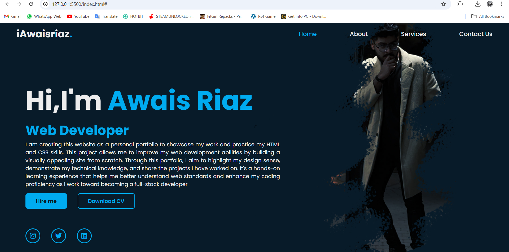

# Personal Portfolio Website

I am creating this website as a personal portfolio to showcase my work and practice my HTML and CSS skills. This project allows me to improve my web development abilities by building a visually appealing site from scratch. Through this portfolio, I aim to highlight my design sense, demonstrate my technical knowledge, and share the projects I have worked on. It's a hands-on learning experience that helps me better understand web standards and enhance my coding proficiency as I work toward becoming a full-stack developer.

## Features
- Simple HTML and CSS structure
- Use of display flex and position absolute
- Static layout (not responsive)
- Image replacement option for customization

## Preview


## Instructions

### 1. Download the project

Click on the green "Code" button at the top right of the repository, then select "Download ZIP" to download the project to your computer.

### 2. Extract the ZIP file

Once downloaded, extract the ZIP file into a folder on your computer.

### 3. Open the project in a code editor

After extracting the ZIP file:
- Open your terminal/command prompt
- Navigate to the extracted folder
- Open the folder in your code editor (e.g., VS Code)

#### Using Visual Studio Code:
```bash
cd your-extracted-folder
code .
